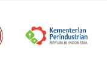

# SIMAGANG — Portal Magang BBKB

<p align="center">
  
  &nbsp;&nbsp;
  
</p>

<p align="center">
  <strong>SIMAGANG</strong> — Sistem Informasi Magang Digital BBKB Yogyakarta<br/>
  <em>Portfolio demo · Next.js</em>
</p>

<p align="center">
  <a href="https://simagangporto.vercel.app">🌐 Live Demo</a>
</p>

Aplikasi aktif ada di folder **`web/`** (Next.js), deploy ke **Vercel** sebagai portfolio demo.

## Struktur Repo

```
Projectbatika/
├── web/                  ← Next.js (deploy ini ke Vercel)
├── archive/
│   └── laravel/          ← Laravel 12 (diarsipkan, tidak dihapus)
└── README.md
```

## Jalankan Next.js (Lokal)

```bash
cd web
cp .env.example .env
# isi DATABASE_URL dan AUTH_SECRET

npm install
npx prisma db push
npm run db:seed
npm run dev
```

Buka http://localhost:3000

## Deploy Vercel

1. Connect repo GitHub ke Vercel
2. Set **Root Directory** = `web`
3. Set environment variables (lihat `web/DEPLOY.md`)
4. Deploy

## Pulihkan Laravel

Lihat [`archive/laravel/README-RESTORE.md`](archive/laravel/README-RESTORE.md)

## Akun Demo (Next.js, setelah seed)

| Role | Email | Password |
|------|-------|----------|
| Admin | admin@simagang.bbkb | admin12345 |
| User | demo@simagang.bbkb | user12345 |
